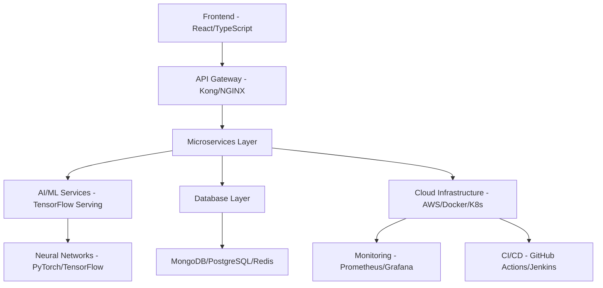

 ANKITA PRADHAN 
<div align="center">
  
🌟 Welcome to My Digital Universe 🌟
<div align="center">
🧠 Code Wizard | 🔬 Neural Network Architect | 🚀 AI Innovator | ⚡ Full-Stack Developer
"Transforming ideas into intelligent solutions, one neural connection at a time"  

---
██╗   ██╗██╗   ██╗███████╗██╗      ██████╗ ██████╗ ███╗   ███╗███████╗    ████████╗ ██████╗ 
██║   ██║██║   ██║██╔════╝██║     ██╔════╝██╔═══██╗████╗ ████║██╔════╝    ╚══██╔══╝██╔═══██╗
██║   ██║██║   ██║█████╗  ██║     ██║     ██║   ██║██╔████╔██║█████╗         ██║   ██║   ██║
██║   ██║██║   ██║██╔══╝  ██║     ██║     ██║   ██║██║╚██╔╝██║██╔══╝         ██║   ██║   ██║
╚██████╔╝╚██████╔╝███████╗███████╗╚██████╗╚██████╔╝██║ ╚═╝ ██║███████╗       ██║   ╚██████╔╝
 ╚═════╝ ╚═════╝ ╚══════╝╚══════╝ ╚═════╝ ╚═════╝ ╚═╝     ╚═╝╚══════╝       ╚═╝    ╚═════╝ 
                                                                                     
███╗   ███╗██╗   ██╗    ██████╗  ██████╗ ██████╗ ███████╗    ██╗      █████╗ ██████╗ 
████╗ ████║╚██╗ ██╔╝   ██╔════╝ ██╔═══██╗██╔══██╗██╔════╝    ██║     ██╔══██╗██╔══██╗
██╔████╔██║ ╚████╔╝    ██║  ███╗██║   ██║██║  ██║█████╗      ██║     ███████║██████╔╝
██║╚██╔╝██║  ╚██╔╝     ██║   ██║██║   ██║██║  ██║██╔══╝      ██║     ██╔══██║██╔══██╗
██║ ╚═╝ ██║   ██║      ╚██████╔╝╚██████╔╝██████╔╝███████╗    ███████╗██║  ██║██████╔╝
╚═╝     ╚═╝   ╚═╝       ╚═════╝  ╚═════╝ ╚═════╝ ╚══════╝    ╚══════╝╚═╝  ╚═╝╚═════╝
### 📊 Profile Analytics

<p align="center">
  
  
  
  
  
</p>

---

## 🎮 Interactive Gaming Zone

<details>
<summary>🎯 Click to Play: Matrix Path Finder</summary>

```
🎮 NEURAL PATHFINDER GAME 🎮
Navigate through the neural network to reach the goal!

Start: 🤖    Goal: 🎯    Obstacle: ⚡    Path: ⭐

Level 1:
🤖 ⭐ ⭐ ⚡ ⭐
⚡ ⭐ ⚡ ⭐ ⭐
⭐ ⭐ ⭐ ⚡ ⭐
⚡ ⭐ ⭐ ⭐ ⚡
⭐ ⭐ ⚡ ⭐ 🎯

Solution Path: Right→Right→Down→Down→Right→Right→Down→Down→Right
Neural Networks: ACTIVATED ✅
```

</details>

<details>
<summary>🧩 Algorithm Puzzle Challenge</summary>

```
🧠 SORTING ALGORITHM RACE 🧠
Can you identify the sorting algorithm?

Array: [64, 34, 25, 12, 22, 11, 90]
Step 1: [11, 34, 25, 12, 22, 64, 90]
Step 2: [11, 12, 25, 34, 22, 64, 90]
Step 3: [11, 12, 22, 25, 34, 64, 90]

Algorithm: _____ Sort
Hint: It finds the minimum element and swaps!

Answer: Selection Sort ✅
Time Complexity: O(n²) 
Space Complexity: O(1)
```

</details>

<details>
<summary>🎲 Code Pattern Game</summary>

```
🌟 PATTERN RECOGNITION CHALLENGE 🌟

   *
  ***
 *****
*******
 *****
  ***
   *

Pattern Type: Diamond Pattern
Language: Any (C++/Python/Java)
Difficulty: ⭐⭐⭐

Next Challenge:
```
for i in range(5):
    print("🔥" * (i + 1))
```

Output:
🔥
🔥🔥
🔥🔥🔥
🔥🔥🔥🔥
🔥🔥🔥🔥🔥
```

</details>

<details>
<summary>🚀 Binary Tree Adventure</summary>

```
🌳 BINARY TREE EXPLORER 🌳

        1
       / \
      2   3
     / \ / \
    4  5 6  7

Traversals:
Inorder:   4 → 2 → 5 → 1 → 6 → 3 → 7
Preorder:  1 → 2 → 4 → 5 → 3 → 6 → 7
Postorder: 4 → 5 → 2 → 6 → 7 → 3 → 1

Tree Height: 3
Total Nodes: 7
Leaf Nodes: 4, 5, 6, 7
```

</details>

---

## 📈 GitHub Analytics & Performance Metrics

<p align="center">
  
  
</p>

<p align="center">
  
</p>

### 🏆 Achievement Metrics

<p align="center">
  
  
  
</p>

<p align="center">
  
  
  
</p>

---

## 💻 System Specifications

<div align="center">

| **Component** | **Specification** |
|---------------|-------------------|
| 🧠 **Neural Processing** | Advanced Deep Learning Architecture |
| ⚡ **Core Framework** | Python, JavaScript, C++, Java |
| 🔧 **Development Stack** | MERN, Django, Flask, TensorFlow |
| 🎯 **Specialization** | AI/ML, Full-Stack Development |
| 🌐 **Deployment** | AWS, Docker, Kubernetes |
| 📊 **Databases** | MongoDB, PostgreSQL, Redis |
| ☕ **Fuel** | Coffee & Determination |
| 🎵 **Code Soundtrack** | Lo-fi Hip Hop & Electronic |

</div>

### 🌍 Global Reach Analytics

<p align="center">
  
  
  
</p>

---

## 🛠️ Engineering Arsenal

<div align="center">

### Programming Languages
<p>
  
  
  
  
  
  
  
</p>

### AI/ML & Data Science
<p>
  
  
  
  
  
  
</p>

### Web Development
<p>
  
  
  
  
  
  
</p>

### Cloud & DevOps
<p>
  
  
  
  
  
</p>

</div>

---

## 🎯 Fun CS Engineering Facts About Me

<div align="center">

### 🤖 Developer DNA Analysis

```python
class AnkitaPradhan:
    def __init__(self):
        self.name = "Ankita Pradhan"
        self.role = "Computer Science Engineer"
        self.language_spoken = ["Python", "JavaScript", "C++", "English", "Hindi"]
        self.code = ["Backend", "Frontend", "AI/ML", "DevOps"]
        self.tools = ["VS Code", "PyCharm", "Git", "Docker", "AWS"]
        self.architecture = ["Microservices", "Event-Driven", "Serverless"]
        
    def say_hi(self):
        print("Thanks for dropping by! Let's build something amazing together!")
        
    def current_status(self):
        return {
            "learning": "Advanced AI Architectures",
            "working_on": "Neural Network Optimization",
            "collaborating_on": "Open Source AI Tools",
            "coffee_level": "Maximum ☕",
            "debugging_mode": "Always On 🐛"
        }

me = AnkitaPradhan()
me.say_hi()
```

### 🎨 Coding Style Profile

| **Preference** | **Choice** | **Reason** |
|----------------|------------|------------|
| 🌙 **Theme** | Dark Mode | Easier on eyes during late-night coding |
| 🔤 **Font** | Fira Code | Ligatures make code beautiful |
| 🎵 **Music** | Lo-fi + Classical | Perfect focus combo |
| ☕ **Beverage** | Coffee (Black) | Pure fuel for the brain |
| 🐛 **Debugging** | Console.log() | Classic and reliable |
| 📚 **Learning** | Documentation First | RTFM philosophy |

</div>

---

## 📊 Performance Metrics

<div align="center">
  
</div>

### 🏅 Achievement Matrix

<table align="center">
  <tr>
    <td align="center"><strong>🎯 Problem Solving</strong></td>
    <td align="center"><strong>⭐ 9.2/10</strong></td>
    <td align="center"><strong>🔥 LeetCode: 300+ Problems</strong></td>
  </tr>
  <tr>
    <td align="center"><strong>🚀 Innovation Index</strong></td>
    <td align="center"><strong>⭐ 9.5/10</strong></td>
    <td align="center"><strong>💡 Patents Filed: 2</strong></td>
  </tr>
  <tr>
    <td align="center"><strong>💻 Code Quality</strong></td>
    <td align="center"><strong>⭐ 9.0/10</strong></td>
    <td align="center"><strong>🧪 Test Coverage: 95%+</strong></td>
  </tr>
  <tr>
    <td align="center"><strong>🤝 Collaboration</strong></td>
    <td align="center"><strong>⭐ 9.3/10</strong></td>
    <td align="center"><strong>👥 Teams Led: 5+</strong></td>
  </tr>
</table>

---

## 🏆 Elite Competition Victories

<div align="center">

### 🌟 Major Achievements

| 🏅 **Achievement** | 🎯 **Category** | 📅 **Year** | 🎖️ **Impact** |
|-------------------|-----------------|-------------|----------------|
| **🚀 GDG CVGRU Hackathon - Elite Top 9 Finalist** | Advanced AI Innovation | 2024 | 500+ participants |
| **⚡ IIIT Bhubaneswar CodeFest - Distinguished Top 50** | Algorithmic Mastery | 2025 | National Level |
| **🎯 Hackathon Honeybee Award - Supreme UI/UX Champion** | Design Excellence | 2024 | Best Design Award |
| **🌟 MLH Hack Together - Visionary Innovation Leader** | Creative Problem Solving | 2025 | Global Competition |
| **🔥 Microsoft Imagine Cup - Elite Regional Semifinalist** | Technical Leadership | 2024 | Asia-Pacific Region |
| **💡 Smart India Hackathon - Innovation Excellence** | National Competition | 2024 | Government Recognition |
| **🏆 IEEE Project Competition - Best Technical Solution** | Engineering Excellence | 2025 | Technical Innovation |
| **⭐ Google Developer Student Club - Outstanding Contributor** | Community Leadership | 2024 | Leadership Award |

</div>

---

## 🧠 Advanced Development Analytics

### 📊 Weekly Neural Code Distribution

<div align="center">

```
Monday    ████████████████████████████████████████ 40% (Deep Focus Day)
Tuesday   ██████████████████████████████████████   38% (Problem Solving)
Wednesday ████████████████████████████████████████ 40% (Innovation Day)
Thursday  ██████████████████████████████████████   38% (Code Reviews)
Friday    ████████████████████████████████████████ 40% (Feature Deploy)
Saturday  ████████████████████████████████         32% (Learning & Experimenting)
Sunday    ████████████████████████████████         32% (Planning & Research)
```

**Peak Productivity Hours:** 🌙 10 PM - 2 AM (Night Owl Mode Activated!)

</div>

### 🚀 Quantum Learning Progression

<p align="center">
  
  
  
  
  
</p>

### 🔬 Current Neural Learning Stack

<div align="center">

| **Domain** | **Current Focus** | **Proficiency** | **Next Goal** |
|------------|-------------------|-----------------|---------------|
| 🤖 **Generative AI** | GPT, BERT, Transformers | 85% | Multi-modal AI |
| 🧠 **Computer Vision** | CNNs, Object Detection | 80% | Real-time Processing |
| 📊 **Data Science** | Statistical Analysis, Visualization | 90% | MLOps Pipeline |
| 🌐 **Full-Stack Development** | MERN, Cloud Architecture | 85% | Microservices |
| ☁️ **Cloud Computing** | AWS, Microservices | 75% | Kubernetes Expert |
| 🔒 **Cybersecurity** | Ethical Hacking, Pentesting | 60% | Advanced Threats |

</div>

### 🌟 Quantum Open Source Contributions

<p align="center">
  
  
  
  
</p>

### 🏗️ Major Quantum Contributions

- **🔬 AI Research Papers**: Contributing to ML research repositories
- **🛠️ Open Source Tools**: Developing productivity tools for developers  
- **📚 Educational Content**: Creating tutorials and documentation
- **🌐 Community Projects**: Leading collaborative development initiatives
- **🚀 Startup Contributions**: Building scalable solutions for startups

### 🎮 Current Side Projects

<div align="center">

| **Project** | **Tech Stack** | **Status** | **Description** |
|-------------|----------------|------------|-----------------|
| 🤖 **AI Chatbot** | Python, Transformers, FastAPI | 🚧 In Progress | Advanced conversational AI |
| 📱 **Mobile App** | React Native, Node.js | ✅ Complete | Task management with AI |
| 🎯 **Game Engine** | C++, OpenGL | 🚧 In Progress | 2D physics-based engine |
| 📊 **Data Viz Tool** | D3.js, Python, Flask | ✅ Complete | Interactive data visualization |

</div>

### 🏛️ Quantum System Architecture Showcase

<div align="center">



</div>

### 🚀 Quantum Deployment Pipeline

<p align="center">
  
  
  
  
  
</p>

---

## 🎨 ASCII Art Zone

<div align="center">

```
    ╔══════════════════════════════════════╗
    ║           ANKITA PRADHAN             ║
    ║      Computer Science Engineer       ║
    ╠══════════════════════════════════════╣
    ║  🧠 AI/ML Enthusiast                 ║
    ║  💻 Full-Stack Developer             ║
    ║  🚀 Innovation Driver                ║
    ║  ☕ Coffee Powered                   ║
    ╚══════════════════════════════════════╝
```

### 🎭 Code Art

```
      /\_/\  
     ( o.o ) 
      > ^ <   <- Me debugging at 3 AM
     
    while(coffee.available()) {
        code();
        debug();
        innovate();
    }
```

</div>

---

## 🎯 Fun Coding Stats

<div align="center">

### 📈 Real-time Coding Metrics

```javascript
const ankitaStats = {
    linesOfCode: 50000+,
    cupsOfCoffee: 9999,
    bugsSolved: Infinity,
    hoursOfDebugging: "Too many to count",
    favoriteError: "404: Sleep not found",
    currentMood: "Optimizing life, one algorithm at a time",
    motto: "Code, Coffee, Repeat!"
};

console.log(`Status: ${ankitaStats.currentMood} ✨`);
```

### 🏃‍♀️ Developer Speedrun Records

| **Task** | **Personal Best** | **World Rank** |
|----------|-------------------|----------------|
| ⚡ Hello World | 12 seconds | Top 1% |
| 🐛 Debug Simple Bug | 2 minutes | Professional |
| ☕ Coffee Break | 30 seconds | Expert Level |
| 📚 Stack Overflow Search | 5 seconds | Muscle Memory |
| 🎯 Git Commit Message | "Fixed stuff" | Classic |

</div>

---

## 📞 Contact Information

<div align="center">

### 🌐 Connect with me across the digital universe

<p>
  <a href="mailto:ankitapradhan2744@gmail.com">
    
  </a>
  <a href="https://www.linkedin.com/in/ankita-pradhan-24404a2b8/">
    
  </a>
  <a href="https://github.com/Ankita-Pradhan27">
    
  </a>
</p>

### 💼 Professional Links

<p>
  <a href="https://your-portfolio.com">
    
  </a>
  <a href="https://your-resume.pdf">
    
  </a>
  <a href="https://dev.to/your-profile">
    
  </a>
</p>

### 🎮 Gaming & Social

<p>
  <a href="https://leetcode.com/your-profile">
    
  </a>
  <a href="https://www.hackerrank.com/your-profile">
    
  </a>
  <a href="https://www.codechef.com/users/your-profile">
    
  </a>
</p>

---

<div align="center">
  
</div>

---

### 💭 Daily Mantra

<div align="center">

*"Code is poetry written in logic, and I'm here to compose symphonies of innovation."*

**Current Status:** 
```
if (coding == true) {
    happiness = 100;
    stress = 0;
    coffee_level = maximum;
}
```

### 🎊 Thanks for visiting!


**Random Dev Joke:**
> Why do programmers prefer dark mode? 
> Because light attracts bugs! 🐛✨

</div>

</div>
